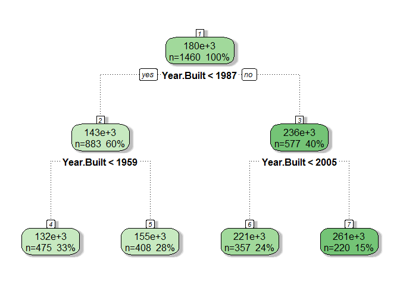
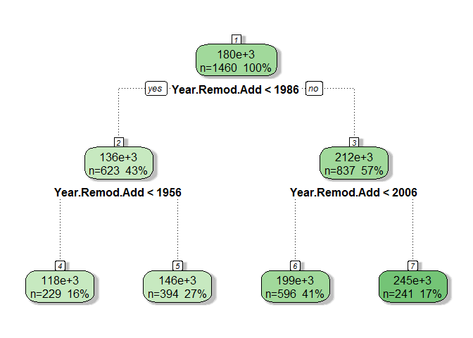
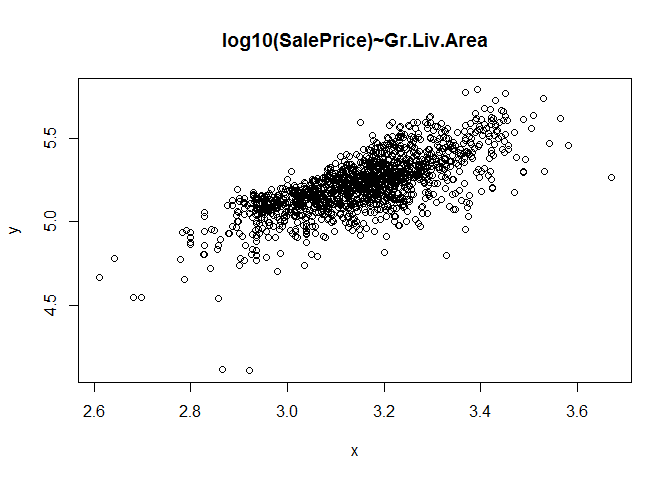
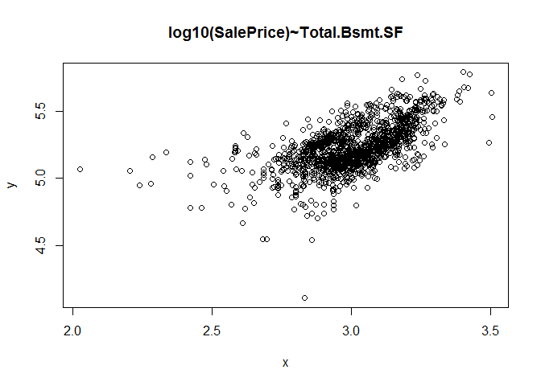
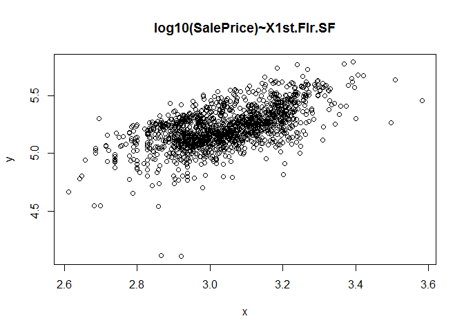
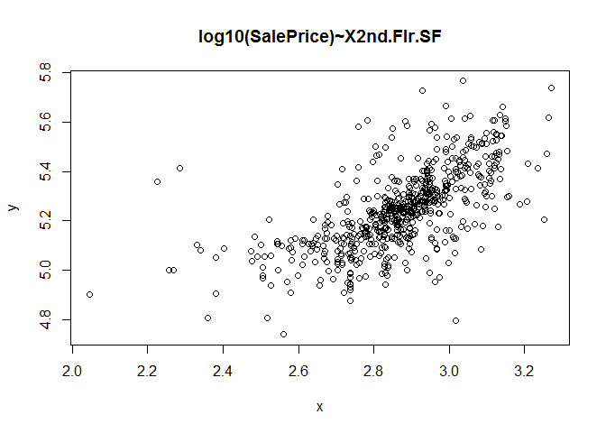

# 1. Preprocessing

``` r
# ------------
# read dataset
# ------------

d1 <- read.csv("./raw_data/train.csv", stringsAsFactors = F)
d2 <- read.csv("./raw_data/test.csv", stringsAsFactors = F)

d2$SalePrice <- -1
d <- rbind(d1,d2); rm(d1,d2)
d$Order <- NULL

# image(t(is.na(d)))

# for (j in colnames(d)){
#   if (sum(is.na(d[,j]))>0) print(j)
# }

# VARIABILI CON NA

# [1] "Lot.Frontage"      num
# [1] "Alley"             OK
# [1] "Mas.Vnr.Area"      OK
# [1] "Bsmt.Qual"         OK       
# [1] "Bsmt.Cond"         OK  
# [1] "Bsmt.Exposure"     OK
# [1] "BsmtFin.Type.1"    OK
# [1] "BsmtFin.SF.1"      OK
# [1] "BsmtFin.Type.2"    OK
# [1] "BsmtFin.SF.2"      OK
# [1] "Bsmt.Unf.SF"       OK
# [1] "Total.Bsmt.SF"     OK
# [1] "Bsmt.Full.Bath"    OK
# [1] "Bsmt.Half.Bath"    OK
# [1] "Fireplace.Qu"      OK
# [1] "Garage.Type"       OK
# [1] "Garage.Yr.Blt"     OK
# [1] "Garage.Finish"     OK
# [1] "Garage.Cars"       OK  
# [1] "Garage.Area"       OK     
# [1] "Garage.Qual"       OK
# [1] "Garage.Cond"       OK
# [1] "Pool.QC"           OK
# [1] "Fence"             OK
# [1] "Misc.Feature"      removed

d2 <- data.frame(PID = d$PID)

# previsioni ottenute con random forest (casi con solo 1 missing)
d2$BsmtFin.SF.1 <- d$BsmtFin.SF.1
d2$BsmtFin.SF.2 <- d$BsmtFin.SF.2
d2$Bsmt.Unf.SF <- d$Bsmt.Unf.SF
d2$Total.Bsmt.SF <- d$Total.Bsmt.SF
d2$BsmtFin.SF.1[which(is.na(d2$BsmtFin.SF.1))] <- 255
d2$BsmtFin.SF.2[which(is.na(d2$BsmtFin.SF.2))] <- 84
d2$Bsmt.Unf.SF[which(is.na(d2$Bsmt.Unf.SF))] <- 437
d2$Total.Bsmt.SF[which(is.na(d2$Total.Bsmt.SF))] <- 718

# moda (casi con pochissimi missing)
d2$Mas.Vnr.Area <- d$Mas.Vnr.Area
d2$Bsmt.Full.Bath <- d$Bsmt.Full.Bath
d2$Bsmt.Half.Bath <- d$Bsmt.Half.Bath
d2$Mas.Vnr.Area[is.na(d2$Mas.Vnr.Area)]<-0
d2$Bsmt.Full.Bath[is.na(d2$Bsmt.Full.Bath)] <- 0 
d2$Bsmt.Half.Bath[is.na(d2$Bsmt.Half.Bath)] <- 0 

# Bsmt.Qual
d2$Bsmt.Qual <- d$Bsmt.Qual
d2$Bsmt.Qual[is.na(d2$Bsmt.Qual)|d2$Bsmt.Qual==''] = '0'
d2$Bsmt.Qual[d2$Bsmt.Qual=='Po'] = '1'
d2$Bsmt.Qual[d2$Bsmt.Qual=='Fa'] = '1'
d2$Bsmt.Qual[d2$Bsmt.Qual=='TA'] = '2'
d2$Bsmt.Qual[d2$Bsmt.Qual=='Gd'] = '3'
d2$Bsmt.Qual[d2$Bsmt.Qual=='Ex'] = '4'
d2$Bsmt.Qual <- as.integer(d2$Bsmt.Qual)
table(d2$Bsmt.Qual)
```

    ## 
    ##    0    1    2    3    4 
    ##   80   90 1283 1219  258

``` r
# Bsmt.Cond
d2$Bsmt.Cond <- d$Bsmt.Cond
d2$Bsmt.Cond[is.na(d2$Bsmt.Cond)|d2$Bsmt.Cond==''] = '0'
d2$Bsmt.Cond[d2$Bsmt.Cond == 'Po'] = '1'
d2$Bsmt.Cond[d2$Bsmt.Cond == 'Fa'] = '1'
d2$Bsmt.Cond[d2$Bsmt.Cond == 'TA'] = '2'
d2$Bsmt.Cond[d2$Bsmt.Cond == 'Gd'|d2$Bsmt.Cond == 'Ex'] = '3'
d2$Bsmt.Cond <- as.numeric(d2$Bsmt.Cond)
table(d2$Bsmt.Cond)
```

    ## 
    ##    0    1    2    3 
    ##   80  109 2616  125

``` r
# Bsmt.Exposure
d2$Bsmt.Exposure <- d$Bsmt.Exposure
d2$Bsmt.Exposure[is.na(d2$Bsmt.Exposure)|d2$Bsmt.Exposure==''] = '0'
d2$Bsmt.Exposure[d2$Bsmt.Exposure == 'No'] = '0'
d2$Bsmt.Exposure[d2$Bsmt.Exposure == 'Mn'] = '1'
d2$Bsmt.Exposure[d2$Bsmt.Exposure == 'Av'] = '2'
d2$Bsmt.Exposure[d2$Bsmt.Exposure == 'Gd'] = '3'
d2$Bsmt.Exposure <- as.numeric(d2$Bsmt.Exposure)

# BsmtFin.Type.1
d2$BsmtFin.Type.1 <- d$BsmtFin.Type.1
d2$BsmtFin.Type.1[is.na(d2$BsmtFin.Type.1)|d2$BsmtFin.Type.1==''] <- '0'
d2$BsmtFin.Type.1[d2$BsmtFin.Type.1 == 'Unf'] <- '1'
d2$BsmtFin.Type.1[d2$BsmtFin.Type.1 == 'LwQ'] <- '2'
d2$BsmtFin.Type.1[d2$BsmtFin.Type.1 == 'Rec'] <- '3'
d2$BsmtFin.Type.1[d2$BsmtFin.Type.1 == 'BLQ'] <- '4'
d2$BsmtFin.Type.1[d2$BsmtFin.Type.1 == 'ALQ'] <- '5'
d2$BsmtFin.Type.1[d2$BsmtFin.Type.1 == 'GLQ'] <- '6'
d2$BsmtFin.Type.1 <- as.numeric(d2$BsmtFin.Type.1)
table(d2$BsmtFin.Type.1)
```

    ## 
    ##   0   1   2   3   4   5   6 
    ##  80 851 154 288 269 429 859

``` r
# BsmtFin.Type.2
d2$BsmtFin.Type.2 <- d$BsmtFin.Type.2
d2$BsmtFin.Type.2[is.na(d2$BsmtFin.Type.2)|d2$BsmtFin.Type.2==''] <- '0'
d2$BsmtFin.Type.2[d2$BsmtFin.Type.2 == 'Unf'] <- '1'
d2$BsmtFin.Type.2[d2$BsmtFin.Type.2 == 'LwQ'] <- '2'
d2$BsmtFin.Type.2[d2$BsmtFin.Type.2 == 'Rec'] <- '3'
d2$BsmtFin.Type.2[d2$BsmtFin.Type.2 == 'BLQ'] <- '4'
d2$BsmtFin.Type.2[d2$BsmtFin.Type.2 == 'ALQ'] <- '5'
d2$BsmtFin.Type.2[d2$BsmtFin.Type.2 == 'GLQ'] <- '6'
d2$BsmtFin.Type.2 <- as.numeric(d2$BsmtFin.Type.2)
table(d2$BsmtFin.Type.2)
```

    ## 
    ##    0    1    2    3    4    5    6 
    ##   81 2499   89  106   68   53   34

``` r
# Alley
d2$NOM.Alley <- d$Alley
d2$NOM.Alley[is.na(d2$NOM.Alley)] <- 'None'

# Fireplace.Qu
d2$Fireplace.Qu <- d$Fireplace.Qu
d2$Fireplace.Qu[is.na(d2$Fireplace.Qu)|d2$Fireplace.Qu==''] <- '0'
d2$Fireplace.Qu[d2$Fireplace.Qu=='Po'] <- '1'
d2$Fireplace.Qu[d2$Fireplace.Qu=='Fa'] <- '2'
d2$Fireplace.Qu[d2$Fireplace.Qu=='TA'] <- '3'
d2$Fireplace.Qu[d2$Fireplace.Qu=='Gd'] <- '4'
d2$Fireplace.Qu[d2$Fireplace.Qu=='Ex'] <- '5'
d2$Fireplace.Qu <- as.numeric(d2$Fireplace.Qu)
table(d2$Fireplace.Qu)
```

    ## 
    ##    0    1    2    3    4    5 
    ## 1422   46   75  600  744   43

``` r
# Garage.Type
d2$NOM.Garage.Type <- d$Garage.Type
d2$NOM.Garage.Type[is.na(d2$NOM.Garage.Type)] <- 'None'

# Garage.Yr.Blt
x <- d[d$SalePrice!=-1,]
fit.tree=rpart(SalePrice~Garage.Yr.Blt,data=x)
fancyRpartPlot(fit.tree, sub = '')
```


``` r
d2$NOM.Garage.Year <- 'None'
d2$NOM.Garage.Year[d$Garage.Yr.Blt<1966] = 'Bef.1966'
d2$NOM.Garage.Year[d$Garage.Yr.Blt>=1966&d$Garage.Yr.Blt<1992] = 'Bet.1966.1992'
d2$NOM.Garage.Year[d$Garage.Yr.Blt>=1992&d$Garage.Yr.Blt<2005] = 'Bet.1992.2005'
d2$NOM.Garage.Year[d$Garage.Yr.Blt>=2005] = 'Aft.2005'
table(d2$NOM.Garage.Year)
```

    ## 
    ##      Aft.2005      Bef.1966 Bet.1966.1992 Bet.1992.2005          None 
    ##           468           868           747           688           159

``` r
# Garage.Finish
d2$Garage.Finish <- d$Garage.Finish
d2$Garage.Finish[is.na(d2$Garage.Finish)|d2$Garage.Finish==''] <- '0'
d2$Garage.Finish[d2$Garage.Finish=='Unf'] <- '1'
d2$Garage.Finish[d2$Garage.Finish=='RFn'] <- '2'
d2$Garage.Finish[d2$Garage.Finish=='Fin'] <- '4'
d2$Garage.Finish <- as.numeric(d2$Garage.Finish)
table(d2$Garage.Finish)
```

    ## 
    ##    0    1    2    4 
    ##  159 1231  812  728

``` r
# Garage.Cars
d2$Garage.Cars <- d$Garage.Cars
d2$Garage.Cars[is.na(d2$Garage.Cars)] <- 0

# Garage.Area
d2$Garage.Area <- d$Garage.Area
d2$Garage.Area[which(is.na(d2$Garage.Area))]=419

# Garage.Qual
d2$Garage.Qual <- d$Garage.Qual
d2$Garage.Qual[is.na(d2$Garage.Qual)|d2$Garage.Qual==''] <- '0'
d2$Garage.Qual[d2$Garage.Qual=='Po'|d2$Garage.Qual=='Fa'] <- '1'
d2$Garage.Qual[d2$Garage.Qual=='TA'] <- '2'
d2$Garage.Qual[d2$Garage.Qual=='Gd'|d2$Garage.Qual=='Ex'] <- '3'
d2$Garage.Qual <- as.numeric(d2$Garage.Qual)
table(d2$Garage.Qual)
```

    ## 
    ##    0    1    2    3 
    ##  159  129 2615   27

``` r
# Garage.Cond
d2$Garage.Cond <- d$Garage.Cond
d2$Garage.Cond[is.na(d2$Garage.Cond)|d2$Garage.Cond==''] <- '0'
d2$Garage.Cond[d2$Garage.Cond=='Po'|d2$Garage.Cond=='Fa'] <- '1'
d2$Garage.Cond[d2$Garage.Cond=='TA'] <- '2'
d2$Garage.Cond[d2$Garage.Cond=='Gd'|d2$Garage.Cond=='Ex'] <- '3'
d2$Garage.Cond <- as.numeric(d2$Garage.Cond)
table(d2$Garage.Cond)
```

    ## 
    ##    0    1    2    3 
    ##  159   88 2665   18

``` r
# Pool.QC
d2$NOM.Pool <- 'no'
d2$NOM.Pool[is.na(d$Pool.QC)] <- 'yes'

# Fence
d2$Fence <- '0'
d2$Fence[d$Fence=='MnWw'|d$Fence=='GdWo'] = '1'
d2$Fence[d$Fence=='MnPrv'] = '2'
d2$Fence[d$Fence=='GdPrv'] = '3'
d2$Fence <- as.numeric(d2$Fence)
table(d2$Fence)
```

    ## 
    ##    0    1    2    3 
    ## 2358  124  330  118

``` r
# Lot.Frontage
sum(is.na(d$Lot.Frontage))
```

    ## [1] 490

``` r
# replace missing con regressione
b0 = summary(lm(Lot.Frontage~Lot.Area, data=d))$coef[1]
b1 = summary(lm(Lot.Frontage~Lot.Area, data=d))$coef[2]
d2$Lot.Frontage = d$Lot.Frontage
d2$Lot.Area = d$Lot.Area
m <- is.na(d2$Lot.Frontage)
d2$Lot.Frontage[m] <- b0+b1*d2$Lot.Area[m]

d$Misc.Feature <- NULL

# setdiff(colnames(d), colnames(d2))

# VARIABILI SENZA MISSING MA DA TRATTARE

# [1] "MS.SubClass"    OK   
# [2] "MS.Zoning"      OK  
# [3] "Street"         OK
# [4] "Lot.Shape"      OK
# [5] "Land.Contour"   OK
# [6] "Utilities"      removed
# [7] "Lot.Config"     OK
# [8] "Land.Slope"     OK
# [9] "Neighborhood"   OK
# [10] "Condition.1"   OK  
# [11] "Condition.2"   OK  
# [12] "Bldg.Type"     OK
# [13] "House.Style"   OK   
# [14] "Overall.Qual"  OK  
# [15] "Overall.Cond"  OK
# [16] "Year.Built"    OK   
# [17] "Year.Remod.Add" OK
# [18] "Roof.Style"     OK
# [19] "Roof.Matl"      OK
# [20] "Exterior.1st"   OK
# [21] "Exterior.2nd"   OK
# [22] "Mas.Vnr.Type"   OK
# [23] "Exter.Qual"     OK   
# [24] "Exter.Cond"     OK
# [25] "Foundation"     OK    
# [26] "Heating"        OK  
# [27] "Heating.QC"     OK
# [28] "Central.Air"    OK
# [29] "Electrical"     OK 
# [30] "X1st.Flr.SF"    OK
# [31] "X2nd.Flr.SF"    OK
# [32] "Low.Qual.Fin.SF" OK
# [33] "Gr.Liv.Area"     OK
# [34] "Full.Bath"       OK
# [35] "Half.Bath"       OK
# [36] "Bedroom.AbvGr"   OK
# [37] "Kitchen.AbvGr"   OK
# [38] "Kitchen.Qual"    OK
# [39] "TotRms.AbvGrd"   OK
# [40] "Functional"      OK
# [41] "Fireplaces"      OK
# [43] "Paved.Drive"     OK
# [44] "Wood.Deck.SF"    OK
# [45] "Open.Porch.SF"   OK
# [46] "Enclosed.Porch"  OK
# [47] "X3Ssn.Porch"     OK
# [48] "Screen.Porch"    OK
# [49] "Pool.Area"       removed
# [50] "Pool.QC"         removed
# [51] "Misc.Feature"    removed
# [52] "Misc.Val"        removed
# [53] "Mo.Sold"         OK
# [54] "Yr.Sold"         OK
# [55] "Sale.Type"       OK
# [56] "Sale.Condition"  OK
# [57] "SalePrice"       OK

d2$NOM.MS.SubClass <- d$MS.SubClass
d2$NOM.MS.Zoning <- d$MS.Zoning
d2$NOM.Street <- d$Street
d2$NOM.Lot.Shape <- d$Lot.Shape
d2$NOM.Land.Contour <- d$Land.Contour
d$Utilities <- NULL
d2$NOM.Lot.Config <- d$Lot.Config
d2$NOM.Land.Slope <- 'Gtl'
d2$NOM.Land.Slope[d$Land.Slope!='Gtl'] <- 'Mod'
d2$NOM.Neighborhood <- d$Neighborhood
d2$NOM.Condition.1 <- 'Norm'
d2$NOM.Condition.1[d$Condition.1!='Norm'] <- 'NotNorm'
d2$NOM.Bldg.Type <- d$Bldg.Type
d2$NOM.House.Style <- d$House.Style
d2$Overall.Qual <- d$Overall.Qual
d2$Overall.Cond <- d$Overall.Cond

x <- d[d$SalePrice!=-1,]
fit.tree=rpart(SalePrice~Year.Built,data=x)
fancyRpartPlot(fit.tree, sub = '')
```



``` r
d2$NOM.Year.Built <- 'None'
d2$NOM.Year.Built[d$Year.Built<1959] = 'Bef.1959'
d2$NOM.Year.Built[d$Year.Built>=1959&d$Year.Built<1987] = 'Bet.1959.1987'
d2$NOM.Year.Built[d$Year.Built>=1987&d$Year.Built<2005] = 'Bet.1987.2005'
d2$NOM.Year.Built[d$Year.Built>=2005] = 'Aft.2005'
table(d2$NOM.Year.Built)
```

    ## 
    ##      Aft.2005      Bef.1959 Bet.1959.1987 Bet.1987.2005 
    ##           466           929           853           682

``` r
x <- d[d$SalePrice!=-1,]
fit.tree=rpart(SalePrice~Year.Remod.Add,data=x)
fancyRpartPlot(fit.tree, sub = '')
```



``` r
d2$NOM.Year.Remod.Add <- 'None'
d2$NOM.Year.Remod.Add[d$Year.Remod.Add<1956] = 'Bef.1956'
d2$NOM.Year.Remod.Add[d$Year.Remod.Add>=1956&d$Year.Remod.Add<1986] = 'Bet.1956.1986'
d2$NOM.Year.Remod.Add[d$Year.Remod.Add>=1986&d$Year.Remod.Add<2006] = 'Bet.1986.2006'
d2$NOM.Year.Remod.Add[d$Year.Remod.Add>=2006] = 'Aft.2006'
table(d2$NOM.Year.Remod.Add)
```

    ## 
    ##      Aft.2006      Bef.1956 Bet.1956.1986 Bet.1986.2006 
    ##           494           463           835          1138

``` r
d2$NOM.Roof.Style <- d$Roof.Style
d2$NOM.Roof.Matl <- d$Roof.Matl

d2$NOM.Exterior.1st <- d$Exterior.1st
d2$NOM.Exterior.2nd <- d$Exterior.2nd

d2$NOM.Mas.Vnr.Type <- d$Mas.Vnr.Type

d2$Exter.Qual <- 0
d2$Exter.Qual[d$Exter.Qual=='Fa'] <- 1
d2$Exter.Qual[d$Exter.Qual=='TA'] <- 2
d2$Exter.Qual[d$Exter.Qual=='Gd'] <- 3
d2$Exter.Qual[d$Exter.Qual=='Ex'] <- 4

d2$Exter.Cond <- 0
d2$Exter.Cond[d$Exter.Cond=='Fa'] <- 1
d2$Exter.Cond[d$Exter.Cond=='TA'] <- 2
d2$Exter.Cond[d$Exter.Cond=='Gd'] <- 3
d2$Exter.Cond[d$Exter.Cond=='Ex'] <- 4

d2$NOM.Foundation <- d$Foundation

d2$NOM.Heating <- d$Heating

d2$Heating.QC <- 0
d2$Heating.QC[d$Heating.QC=='Fa'] <- 1
d2$Heating.QC[d$Heating.QC=='TA'] <- 2
d2$Heating.QC[d$Heating.QC=='Gd'] <- 3
d2$Heating.QC[d$Heating.QC=='Ex'] <- 4

d2$NOM.Central.Air <- d$Central.Air

d2$NOM.Electrical <- 'Standard'
d2$NOM.Electrical[d$Electrical!='SBrkr'] <- 'NotStandard'

d2$X1st.Flr.SF <- d$X1st.Flr.SF
d2$X2nd.Flr.SF <- d$X2nd.Flr.SF
d2$Low.Qual.Fin.SF <- d$Low.Qual.Fin.SF
d2$Gr.Liv.Area <- d$Gr.Liv.Area
d2$Full.Bath <- d$Full.Bath
d2$Half.Bath <- d$Half.Bath
d2$Bedroom.AbvGr <- d$Bedroom.AbvGr
d2$Kitchen.AbvGr <- d$Kitchen.AbvGr

d2$Kitchen.Qual <- 0
d2$Kitchen.Qual[d$Kitchen.Qual=='Fa'] <- 1
d2$Kitchen.Qual[d$Kitchen.Qual=='TA'] <- 2
d2$Kitchen.Qual[d$Kitchen.Qual=='Gd'] <- 3
d2$Kitchen.Qual[d$Kitchen.Qual=='Ex'] <- 4

d2$TotRms.AbvGrd <- d$TotRms.AbvGrd

d2$NOM.Functional <- 'Typ'
d2$NOM.Functional[d$Functional!='Typ'] <- 'NotTyp'

d2$Fireplaces <- d$Fireplaces

d2$NOM.Paved.Drive <- 'Paved'
d2$NOM.Paved.Drive[d$Paved.Drive!='Y'] <- 'NotPaved'

d2$Wood.Deck.SF <- d$Wood.Deck.SF
d2$Open.Porch.SF <- d$Open.Porch.SF
d2$Enclosed.Porch <- d$Enclosed.Porch
d2$X3Ssn.Porch <- d$X3Ssn.Porch
d2$Screen.Porch <- d$Screen.Porch

d$Pool.Area <- NULL
d$Pool.QC <- NULL
d$Misc.Feature <- NULL
d$Misc.Val <- NULL

d2$Mo.Sold <- d$Mo.Sold
d2$Yr.Sold <- d$Yr.Sold

d2$NOM.Sale.Type <- d$Sale.Type
d2$NOM.Sale.Condition <- d$Sale.Condition

d2$SalePrice <- d$SalePrice

d2$PID <- NULL

train <- d2[d2$SalePrice!=-1,]
test <- d2[d2$SalePrice==-1,]

# write.csv(train, './new_data/train.csv', row.names = F)
# write.csv(test, './new_data/test.csv', row.names = F)
```

2. Modeling
-----------

``` r
d1 <- train
d2 <- test

d <- rbind(d1,d2)

# variabili factor nominali

toFactor <- grepl('NOM.',colnames(d1))
d[toFactor] <- lapply(d[toFactor], as.factor)
rm(d1,d2)

f <- function(x) return(log10(x+1))

var = c("Gr.Liv.Area","Total.Bsmt.SF","X1st.Flr.SF","X2nd.Flr.SF")
d[,var] = lapply(d[,var], f)
d$NOM.Neighborhood[d$NOM.Neighborhood=='Landmrk']='NAmes'

# train e test

dtrain <- d[d$SalePrice!=-1,]
dtest <- d[d$SalePrice==-1,]
dtest$SalePrice<-NULL

# rf

# variabili da rimuovere
via <- c("BsmtFin.SF.2","NOM.Pool","Fence","NOM.Street","NOM.Land.Contour","NOM.Land.Slope","NOM.Condition.1","NOM.Roof.Matl","Low.Qual.Fin.SF","Enclosed.Porch","X3Ssn.Porch","Mo.Sold","Yr.Sold")
set.seed(1)
fit.rf <- randomForest(log10(SalePrice)~., data=dtrain[,-get_positions(dtrain,via)], ntree=5000, importance=T)
ypred <- 10^predict(fit.rf, newdata=dtest[,-get_positions(dtrain,via)])

# ridge

lambda <- 10^seq(10, -2, length = 100)
x <- data.matrix(dtrain[,-ncol(dtrain)])
y <- log10(dtrain$SalePrice+1)
xtest <- data.matrix(dtest)
ridge.mod <- glmnet(x, y, alpha = 0, lambda = lambda)
cv.out <- cv.glmnet(x, y, alpha = 0)
(bestlam <- cv.out$lambda.min)
```

    ## [1] 0.01564358

``` r
ypred.ridge <- 10^predict(ridge.mod, s = bestlam, newx = xtest)-1

# lm

formula <- log10(SalePrice)~ Gr.Liv.Area+Total.Bsmt.SF+Kitchen.Qual+
  X2nd.Flr.SF+Overall.Qual+Overall.Cond+NOM.Condition.1+
  NOM.Sale.Condition+NOM.Neighborhood+NOM.MS.Zoning+Bsmt.Exposure+Bsmt.Full.Bath

fit1 <- lm(formula, data=dtrain[dtrain$Bsmt.Qual!=0,])
ypred.lm <- 10^predict(fit1, newdata=dtest[dtest$Bsmt.Qual!=0,])
summary(fit1)
```

    ## 
    ## Call:
    ## lm(formula = formula, data = dtrain[dtrain$Bsmt.Qual != 0, ])
    ## 
    ## Residuals:
    ##      Min       1Q   Median       3Q      Max 
    ## -0.62481 -0.02741  0.00171  0.03100  0.21013 
    ## 
    ## Coefficients:
    ##                            Estimate Std. Error t value Pr(>|t|)    
    ## (Intercept)                2.773743   0.061101  45.396  < 2e-16 ***
    ## Gr.Liv.Area                0.534123   0.023372  22.854  < 2e-16 ***
    ## Total.Bsmt.SF              0.083958   0.016683   5.033 5.48e-07 ***
    ## Kitchen.Qual               0.021287   0.003435   6.196 7.62e-10 ***
    ## X2nd.Flr.SF               -0.007194   0.002118  -3.397 0.000700 ***
    ## Overall.Qual               0.030335   0.002036  14.898  < 2e-16 ***
    ## Overall.Cond               0.021452   0.001575  13.616  < 2e-16 ***
    ## NOM.Condition.1NotNorm    -0.019086   0.004757  -4.012 6.33e-05 ***
    ## NOM.Sale.ConditionAdjLand  0.016151   0.027177   0.594 0.552419    
    ## NOM.Sale.ConditionAlloca   0.038199   0.024841   1.538 0.124353    
    ## NOM.Sale.ConditionFamily   0.039329   0.014102   2.789 0.005362 ** 
    ## NOM.Sale.ConditionNormal   0.040928   0.006283   6.514 1.03e-10 ***
    ## NOM.Sale.ConditionPartial  0.077995   0.008662   9.004  < 2e-16 ***
    ## NOM.NeighborhoodBlueste    0.013174   0.033424   0.394 0.693525    
    ## NOM.NeighborhoodBrDale    -0.035980   0.027806  -1.294 0.195891    
    ## NOM.NeighborhoodBrkSide   -0.019592   0.018198  -1.077 0.281848    
    ## NOM.NeighborhoodClearCr    0.009823   0.019331   0.508 0.611436    
    ## NOM.NeighborhoodCollgCr    0.030480   0.015392   1.980 0.047879 *  
    ## NOM.NeighborhoodCrawfor    0.029956   0.017080   1.754 0.079670 .  
    ## NOM.NeighborhoodEdwards   -0.033896   0.016431  -2.063 0.039313 *  
    ## NOM.NeighborhoodGilbert    0.037565   0.016282   2.307 0.021193 *  
    ## NOM.NeighborhoodGreens    -0.010865   0.029989  -0.362 0.717188    
    ## NOM.NeighborhoodGrnHill    0.248719   0.059974   4.147 3.57e-05 ***
    ## NOM.NeighborhoodIDOTRR    -0.054629   0.019608  -2.786 0.005408 ** 
    ## NOM.NeighborhoodMeadowV   -0.070519   0.022595  -3.121 0.001840 ** 
    ## NOM.NeighborhoodMitchel    0.021934   0.017049   1.287 0.198480    
    ## NOM.NeighborhoodNAmes     -0.012507   0.015764  -0.793 0.427670    
    ## NOM.NeighborhoodNoRidge    0.083748   0.017785   4.709 2.74e-06 ***
    ## NOM.NeighborhoodNPkVill   -0.008812   0.021298  -0.414 0.679123    
    ## NOM.NeighborhoodNridgHt    0.082090   0.016087   5.103 3.82e-07 ***
    ## NOM.NeighborhoodNWAmes     0.010096   0.016649   0.606 0.544362    
    ## NOM.NeighborhoodOldTown   -0.066084   0.017325  -3.814 0.000143 ***
    ## NOM.NeighborhoodSawyer     0.010711   0.016734   0.640 0.522230    
    ## NOM.NeighborhoodSawyerW    0.017120   0.016602   1.031 0.302623    
    ## NOM.NeighborhoodSomerst    0.072777   0.019599   3.713 0.000213 ***
    ## NOM.NeighborhoodStoneBr    0.076743   0.018468   4.155 3.45e-05 ***
    ## NOM.NeighborhoodSWISU     -0.044677   0.019889  -2.246 0.024842 *  
    ## NOM.NeighborhoodTimber     0.042927   0.017503   2.453 0.014310 *  
    ## NOM.NeighborhoodVeenker    0.014296   0.023001   0.622 0.534355    
    ## NOM.MS.ZoningFV            0.080589   0.025592   3.149 0.001673 ** 
    ## NOM.MS.ZoningI (all)       0.075884   0.060990   1.244 0.213633    
    ## NOM.MS.ZoningRH            0.108640   0.027042   4.017 6.20e-05 ***
    ## NOM.MS.ZoningRL            0.102363   0.020434   5.009 6.17e-07 ***
    ## NOM.MS.ZoningRM            0.080099   0.019341   4.141 3.66e-05 ***
    ## Bsmt.Exposure              0.011717   0.001729   6.776 1.82e-11 ***
    ## Bsmt.Full.Bath             0.027945   0.003297   8.475  < 2e-16 ***
    ## ---
    ## Signif. codes:  0 '***' 0.001 '**' 0.01 '*' 0.05 '.' 0.1 ' ' 1
    ## 
    ## Residual standard error: 0.0577 on 1375 degrees of freedom
    ## Multiple R-squared:  0.8891, Adjusted R-squared:  0.8855 
    ## F-statistic:   245 on 45 and 1375 DF,  p-value: < 2.2e-16

``` r
# media ponderata
yy <- (ypred*0.6+ypred.ridge*0.4)

# bsmt != 0
yy[dtest$Bsmt.Qual!=0] <- (ypred[dtest$Bsmt.Qual!=0]*0.4 + ypred.ridge[dtest$Bsmt.Qual!=0]*0.3 + ypred.lm*0.3)


#==================
# gbm
set.seed(1)
fit.gbm <- gbm(log10(SalePrice)~., data=dtrain, distribution = "gaussian",
              n.trees = 10000, shrinkage = 0.001, interaction.depth = 6, n.minobsinnode = 20)
ypred.gbm <- 10^predict(fit.gbm, newdata = dtest, n.trees = 10000)
# media ponderata
yy2 <- (ypred.gbm*0.7+ypred.ridge*0.3)
# bsmt != 0
yy2[dtest$Bsmt.Qual!=0] <- (ypred.gbm[dtest$Bsmt.Qual!=0]*0.5 + ypred.ridge[dtest$Bsmt.Qual!=0]*0.2 + ypred.lm*0.3)

#==================
# consegna
# write.table(yy2, './predictions/AmesSubmission_gbm_ridge_lm.txt', row.names = F, col.names = F)
```

3. Visualization
----------------

``` r
vars = c("Gr.Liv.Area","Total.Bsmt.SF","X1st.Flr.SF","X2nd.Flr.SF")
for (var in vars){
  quali = which(dtrain[var]!=0)
  y = log10(dtrain[quali, "SalePrice"])
  x = dtrain[quali,var]
  plot(x,y, main=paste('log10(SalePrice)~',var,sep=''))
}
```


