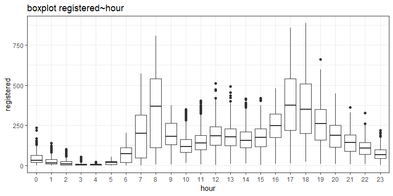
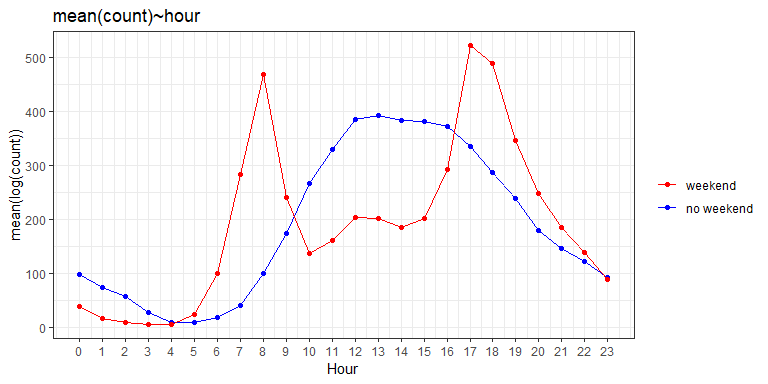
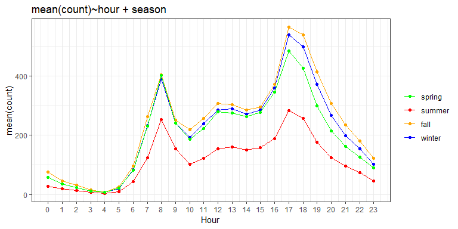
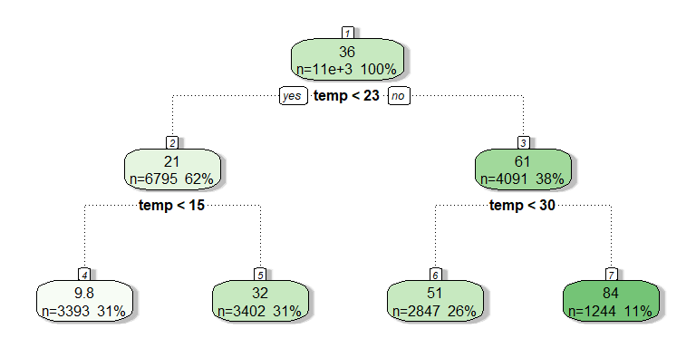

# 1. Preprocessing

``` r
d1 = read.csv("./raw_data/99.csv"); 
d2 = read.csv("./raw_data/100.csv"); d2$casual<-d2$registered<-d2$count<-NA; 
d = rbind(d1,d2);
train<-which(!is.na(d$count)); test<-which(is.na(d$count))
```

Istogrammi variabili risposta
-----------------------------

``` r
ggplot(d1, aes(x=count)) + 
  geom_histogram(aes(y=..density..), binwidth=30, alpha=0.5, color='black') + 
  geom_density(alpha=0.4, lwd=1) + theme_bw() + theme(legend.position="none") + ggtitle("density count")
```


``` r
ggplot(d1, aes(x=registered)) + 
  geom_histogram(aes(y=..density..), binwidth=30, alpha=0.5, color='black') + 
  geom_density(alpha=0.4, lwd=1) + theme_bw() + theme(legend.position="none") + ggtitle("density registered")
```


``` r
ggplot(d1, aes(x=casual)) + 
  geom_histogram(aes(y=..density..), binwidth=30, alpha=0.5, color='black') + 
  geom_density(alpha=0.4, lwd=1) + theme_bw() + theme(legend.position="none") + ggtitle("density casual")
```


Aggiusto stagioni
-----------------

``` r
d$season <- as.factor(d$season)
levels(d$season) <- c('spring', 'summer', 'fall', 'winter')
```

Variabili temporali
-------------------

``` r
d$hour<-as.integer(substr(d$datetime,12,13))
d$day<-as.integer(substr(d$datetime,9,10))
d$wday<-wday(substr(d$datetime,1,10),label = T)
d$month<-as.integer(substr(d$datetime, 6,7))
d$year<-as.integer(substr(d$datetime, 1,4))
d$datetime<-NULL
```

Boxplots
--------

``` r
df1 <- d[train,] ; df1$hour<-as.factor(df1$hour)
ggplot(data=df1, aes(x=hour, y=count))+geom_boxplot()+theme_bw()+ggtitle('boxplot count~hour')
```


``` r
ggplot(data=df1, aes(x=hour, y=log(count+1)))+geom_boxplot()+theme_bw()+ggtitle('boxplot log(count+1)~hour')
```


``` r
ggplot(data=df1, aes(x=hour, y=registered))+geom_boxplot()+theme_bw()+ggtitle('boxplot registered~hour')
```



``` r
ggplot(data=df1, aes(x=hour, y=log(registered+1)))+geom_boxplot()+theme_bw()+ggtitle('boxplot log(registered+1)~hour')
```


``` r
ggplot(data=df1, aes(x=hour, y=casual))+geom_boxplot()+theme_bw()+ggtitle('boxplot casual~hour')
```


``` r
ggplot(data=df1, aes(x=hour, y=log(casual+1)))+geom_boxplot()+theme_bw()+ggtitle('boxplot log(casual+1)~hour')
```


Weekday/Weekend/Workingday
--------------------------

``` r
d$day_type=""
d$day_type[d$holiday==0 & d$workingday==0]="weekend"
d$day_type[d$holiday==1]="holiday"
d$day_type[d$holiday==0 & d$workingday==1]="working day"
table(d$day_type)
```

    ## 
    ##     holiday     weekend working day 
    ##         500        5014       11865

Variabile dummy weekend
-----------------------

``` r
d$weekend="no"
d$weekend[d$wday=="dom" | d$wday=="sab" ]='yes'
table(d$weekend)
```

    ## 
    ##    no   yes 
    ## 12365  5014

Boxplots
--------

``` r
df1 <- d[train,] ; df1$hour<-as.factor(df1$hour)
ggplot(data=df1, aes(x=hour, y=count, fill=weekend))+geom_boxplot()+theme_bw()+ggtitle('boxplot count~hour + weekend')
```


Andamento medie `count` in base all'ora e al weekend
----------------------------------------------------

``` r
m_noweekend<-c(); m_weekend<-c()
for(h in 0:23){
  m_noweekend<-c(m_noweekend,mean(df1[df1$hour==h & df1$weekend=='no','count']))
  m_weekend<-c(m_weekend,mean(df1[df1$hour==h & df1$weekend=='yes','count']))
}
medie_df <- data.frame(we <- m_weekend, nowe <- m_noweekend)
ggplot(data=medie_df)+theme_bw()+
  geom_line(aes(x=0:23,y=we,colour='red'))+geom_point(aes(x=0:23,y=we,colour='red'))+
  geom_line(aes(x=0:23,y=nowe,colour='blue'))+geom_point(aes(x=0:23,y=nowe,colour='blue'))+
  scale_colour_manual(name = "", values=c('red', 'blue'), labels=c('weekend','no weekend'))+
  scale_x_continuous(breaks = 0:23)+xlab("Hour")+ylab("mean(log(count))")+ggtitle('mean(count)~hour')
```



Andamento medie `count` in base all'ora e al weekend + LOG
----------------------------------------------------------

``` r
m_noweekend<-c(); m_weekend<-c()
for(h in 0:23){
  m_noweekend<-c(m_noweekend,mean(log(df1[df1$hour==h & df1$weekend=='no',]$count+1)))
  m_weekend<-c(m_weekend,mean(log(df1[df1$hour==h & df1$weekend=='yes',]$count+1)))
}
medie_df <- data.frame(we <- m_weekend, nowe <- m_noweekend)
ggplot(data=medie_df)+theme_bw()+
  geom_line(aes(x=0:23,y=we,colour='red'))+geom_point(aes(x=0:23,y=we,colour='red'))+
  geom_line(aes(x=0:23,y=nowe,colour='blue') )+geom_point(aes(x=0:23,y=nowe,colour='blue'))+
  scale_colour_manual(name = "", values=c('red', 'blue'), labels=c('weekend','no weekend'))+
  scale_x_continuous(breaks = 0:23)+xlab("Hour")+ylab("mean(count)")+ggtitle('mean(log(count)+1)~hour')
```


Andamento medie `registered` in base all'ora e al weekend
---------------------------------------------------------

``` r
m_noweekend<-c(); m_weekend<-c()
for(h in 0:23){
  m_noweekend<-c(m_noweekend,mean(df1[df1$hour==h & df1$weekend=='no','registered']))
  m_weekend<-c(m_weekend,mean(df1[df1$hour==h & df1$weekend=='yes','registered']))
}
medie_df <- data.frame(we <- m_weekend, nowe <- m_noweekend)
ggplot(data=medie_df)+theme_bw()+
  geom_line(aes(x=0:23,y=we,colour='red'))+geom_point(aes(x=0:23,y=we,colour='red'))+
  geom_line(aes(x=0:23,y=nowe,colour='blue'))+geom_point(aes(x=0:23,y=nowe,colour='blue'))+
  scale_colour_manual(name = "", values=c('red', 'blue'), labels=c('weekend','no weekend'))+
  scale_x_continuous(breaks = 0:23)+xlab("Hour")+ylab("mean(log(registered))")+ggtitle('mean(registered)~hour')
```


Andamento medie `registered` in base all'ora e al weekend + LOG
---------------------------------------------------------------

``` r
m_noweekend<-c(); m_weekend<-c()
for(h in 0:23){
  m_noweekend<-c(m_noweekend,mean(log(df1[df1$hour==h & df1$weekend=='no',]$registered+1)))
  m_weekend<-c(m_weekend,mean(log(df1[df1$hour==h & df1$weekend=='yes',]$registered+1)))
}
medie_df <- data.frame(we <- m_weekend, nowe <- m_noweekend)
ggplot(data=medie_df)+theme_bw()+
  geom_line(aes(x=0:23,y=we,colour='red'))+geom_point(aes(x=0:23,y=we,colour='red'))+
  geom_line(aes(x=0:23,y=nowe,colour='blue') )+geom_point(aes(x=0:23,y=nowe,colour='blue'))+
  scale_colour_manual(name = "", values=c('red', 'blue'), labels=c('weekend','no weekend'))+
  scale_x_continuous(breaks = 0:23)+xlab("Hour")+ylab("mean(registered)")+ggtitle('mean(log(registered)+1)~hour')
```


Andamento medie `casual` in base all'ora e al weekend
-----------------------------------------------------

``` r
m_noweekend<-c(); m_weekend<-c()
for(h in 0:23){
  m_noweekend<-c(m_noweekend,mean(df1[df1$hour==h & df1$weekend=='no','casual']))
  m_weekend<-c(m_weekend,mean(df1[df1$hour==h & df1$weekend=='yes','casual']))
}
medie_df <- data.frame(we <- m_weekend, nowe <- m_noweekend)
ggplot(data=medie_df)+theme_bw()+
  geom_line(aes(x=0:23,y=we,colour='red'))+geom_point(aes(x=0:23,y=we,colour='red'))+
  geom_line(aes(x=0:23,y=nowe,colour='blue'))+geom_point(aes(x=0:23,y=nowe,colour='blue'))+
  scale_colour_manual(name = "", values=c('red', 'blue'), labels=c('weekend','no weekend'))+
  scale_x_continuous(breaks = 0:23)+xlab("Hour")+ylab("mean(log(casual))")+ggtitle('mean(casual)~hour')
```


Andamento medie `casual` in base all'ora e al weekend + LOG
-----------------------------------------------------------

``` r
m_noweekend<-c(); m_weekend<-c()
for(h in 0:23){
  m_noweekend<-c(m_noweekend,mean(log(df1[df1$hour==h & df1$weekend=='no',]$casual+1)))
  m_weekend<-c(m_weekend,mean(log(df1[df1$hour==h & df1$weekend=='yes',]$casual+1)))
}
medie_df <- data.frame(we <- m_weekend, nowe <- m_noweekend)
ggplot(data=medie_df)+theme_bw()+
  geom_line(aes(x=0:23,y=we,colour='red'))+geom_point(aes(x=0:23,y=we,colour='red'))+
  geom_line(aes(x=0:23,y=nowe,colour='blue') )+geom_point(aes(x=0:23,y=nowe,colour='blue'))+
  scale_colour_manual(name = "", values=c('red', 'blue'), labels=c('weekend','no weekend'))+
  scale_x_continuous(breaks = 0:23)+xlab("Hour")+ylab("mean(casual)")+ggtitle('mean(log(casual)+1)~hour')
```


Andamento medie `count` in base all'ora e alla stagione
-------------------------------------------------------

``` r
medie_seas <- data.frame()
for(h in 0:23){
  help_df = df1[df1$hour==h,]
  medie_riga <- c()
  for(s in c('spring', 'summer', 'fall', 'winter')){
    help_df2 = help_df[help_df$season==s,]
    media <- mean(help_df2$count)
    medie_riga <- cbind(medie_riga,media) 
  }
  medie_seas <- rbind(medie_seas,medie_riga)
}
colnames(medie_seas)=c('spring', 'summer', 'fall', 'winter')
ggplot(data=medie_seas)+theme_bw()+
  geom_line(aes(x=0:23,y=spring,colour='green') )+geom_point(aes(x=0:23,y=spring,colour='green'))+
  geom_line(aes(x=0:23,y=summer,colour='red') )+geom_point(aes(x=0:23,y=summer,colour='red'))+
  geom_line(aes(x=0:23,y=fall,colour='orange') )+geom_point(aes(x=0:23,y=fall,colour='orange'))+
  geom_line(aes(x=0:23,y=winter,colour='blue') )+geom_point(aes(x=0:23,y=winter,colour='blue'))+
  scale_colour_manual(name = "", values=c('green', 'red', 'orange', 'blue'), labels=c('spring','summer', 'fall', 'winter'))+
  scale_x_continuous(breaks = 0:23)+xlab("Hour")+ylab("mean(count)")+ggtitle('mean(count)~hour + season')
```



Weather ha solo 3 osservazioni
------------------------------

``` r
d$weather[d$weather==4]<-3
```

Divido l'ora in base a `registered` e `casual`
----------------------------------------------

``` r
fit.tree=rpart(registered~hour,data=d[train,])
fancyRpartPlot(fit.tree, sub = '')
```


``` r
d$hour.cut.reg <- 0
d$hour.cut.reg[d$hour<7] <- 1
d$hour.cut.reg[d$hour>=21] <- 2
d$hour.cut.reg[d$hour<=16&d$hour>=9] <- 3
d$hour.cut.reg[d$hour==7] <- 4
d$hour.cut.reg[d$hour==8] <- 5
d$hour.cut.reg[d$hour==19|d$hour==20] <- 6
d$hour.cut.reg[d$hour==17|d$hour==18] <- 7
table(d$hour.cut.reg)
```

    ## 
    ##    1    2    3    4    5    6    7 
    ## 5001 2184 5826  727  727 1456 1458

``` r
fit.tree=rpart(casual~hour,data=d[train,])
fancyRpartPlot(fit.tree, sub = '')
```


``` r
d$hour.cut.cas <- 0
d$hour.cut.cas[d$hour<=7] <- 1
d$hour.cut.cas[d$hour==8|d$hour==9] <- 2
d$hour.cut.cas[d$hour>=20] <- 3
d$hour.cut.cas[d$hour>=10&d$hour<20] <- 4
table(d$hour.cut.cas)
```

    ## 
    ##    1    2    3    4 
    ## 5728 1454 2912 7285

Divido la temperatura in base a `registered` e `casual`
-------------------------------------------------------

``` r
fit.tree=rpart(registered~temp,data=d[train,])
fancyRpartPlot(fit.tree, sub = '')
```


``` r
d$temp.reg=0
d$temp.reg[d$temp<13]=1
d$temp.reg[d$temp>=13 & d$temp<23]=2
d$temp.reg[d$temp>=23 & d$temp<30]=3
d$temp.reg[d$temp>=30]=4
table(d$temp.reg)
```

    ## 
    ##    1    2    3    4 
    ## 3514 7050 4700 2115

``` r
fit.tree=rpart(casual~temp,data=d[train,])
fancyRpartPlot(fit.tree, sub = '')
```



``` r
d$temp.cas=0
d$temp.cas[d$temp<15]=1
d$temp.cas[d$temp>=15 & d$temp<23]=2
d$temp.cas[d$temp>=23 & d$temp<30]=3
d$temp.cas[d$temp>=30]=4
table(d$temp.cas)
```

    ## 
    ##    1    2    3    4 
    ## 5441 5123 4700 2115

Divido l'umidità in base a `registered` e `casual`
--------------------------------------------------

``` r
fit.tree=rpart(registered~humidity,data=d[train,])
fancyRpartPlot(fit.tree, sub = '')
```


``` r
d$humidity.reg=0
d$humidity.reg[d$humidity>=67]=1
d$humidity.reg[d$humidity>=44 & d$humidity<67]=2
d$humidity.reg[d$humidity<44]=3
table(d$humidity.reg)
```

    ## 
    ##    1    2    3 
    ## 7581 6524 3274

``` r
fit.tree=rpart(casual~humidity,data=d[train,])
fancyRpartPlot(fit.tree, sub = '')
```


``` r
d$humidity.cas=0
d$humidity.cas[d$humidity>=75]=1
d$humidity.cas[d$humidity>=56 & d$humidity<75]=2
d$humidity.cas[d$humidity>=40 & d$humidity<56]=3
d$humidity.cas[d$humidity<40]=4
table(d$humidity.cas)
```

    ## 
    ##    1    2    3    4 
    ## 5417 5320 4387 2255

Medie `groupby` per `registered` e `casual`
-------------------------------------------

``` r
d$mean.reg.weekend.hour <- NA
for(w in c('yes','no')){
  for(t in 0:23){
    quali=which(d$weekend==w & d$hour==t)  
    d$mean.reg.weekend.hour[quali]=mean(log1p(d$registered[quali]),na.rm=T)
  }}
d$mean.cas.weekend.hour <- NA
for(w in c('yes','no')){
  for(t in 0:23){
    quali=which(d$weekend==w & d$hour==t)  
    d$mean.cas.weekend.hour[quali]=mean(log1p(d$casual[quali]),na.rm=T)
  }}
```

Discretizzo variabili
---------------------

``` r
d$holiday <- as.factor(ifelse(d$holiday==1, 'yes', 'no'))
d$workingday <- as.factor(ifelse(d$workingday==1, 'yes', 'no'))
d$weather <- as.factor(d$weather); levels(d$weather)<- letters[1:length(levels(d$weather))]
d$hour.cut.reg <- as.factor(d$hour.cut.reg); levels(d$hour.cut.reg)<- letters[1:length(levels(d$hour.cut.reg))]
d$hour.cut.cas <- as.factor(d$hour.cut.cas); levels(d$hour.cut.cas)<- letters[1:length(levels(d$hour.cut.cas))]
d$temp.reg <- as.factor(d$temp.reg); levels(d$temp.reg)<- letters[1:length(levels(d$temp.reg))]
d$temp.cas <- as.factor(d$temp.cas); levels(d$temp.cas)<- letters[1:length(levels(d$temp.cas))]
d$humidity.reg <- as.factor(d$humidity.reg); levels(d$humidity.reg)<- letters[1:length(levels(d$humidity.reg))]
d$humidity.cas <- as.factor(d$humidity.cas); levels(d$humidity.cas)<- letters[1:length(levels(d$humidity.cas))]
d$weekend <- as.factor(d$weekend)
d$day_type <- as.factor(d$day_type)
```

Stimo valori mancanti per `windspeed`
-------------------------------------

``` r
ggplot(d, aes(x=windspeed)) + 
  geom_histogram(alpha=0.5) + 
  theme_bw() + theme(legend.position="none") + ggtitle("histogram windspeed")
```

    ## `stat_bin()` using `bins = 30`. Pick better value with `binwidth`.


``` r
zeri<-which(d$windspeed==0)
## dwind_train<-d[-zeri,]
## dwind_test<-d[zeri,]; dwind_test$windspeed<-NULL
## myrf_wind <- randomForest(windspeed ~ season+weather+humidity+month+temp+year+atemp, dwind_train, ntree=250, importance=T)
## ywind <- predict(myrf_wind, dwind_test)
## write.csv(ywind, './new_data/windspeed.csv',row.names = F)
d$windspeed[zeri]<-read.csv("./new_data/windspeed.csv")$x
```

Metto le variabili risposta in fondo
------------------------------------

``` r
z<-d$registered; d$registered<-NULL; d$registered<-z; rm(z)
z<-d$casual; d$casual<-NULL; d$casual<-z; rm(z)
z<-d$count; d$count<-NULL; d$count<-z; rm(z)
```
