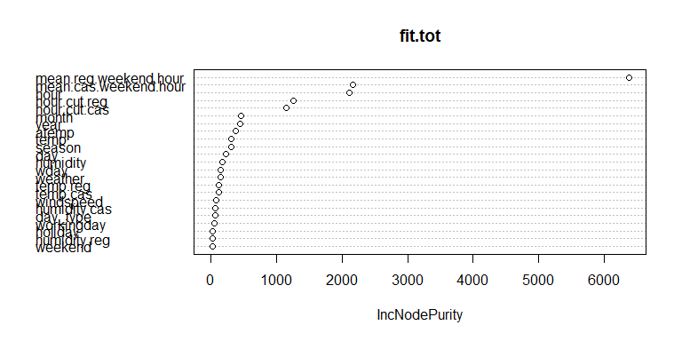
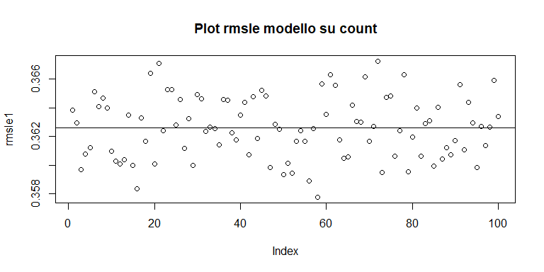
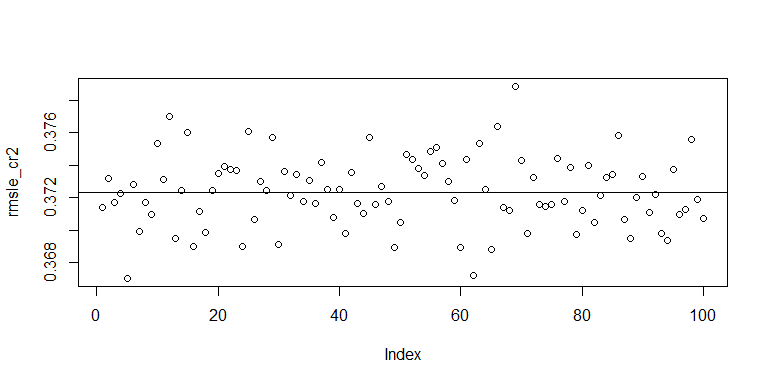
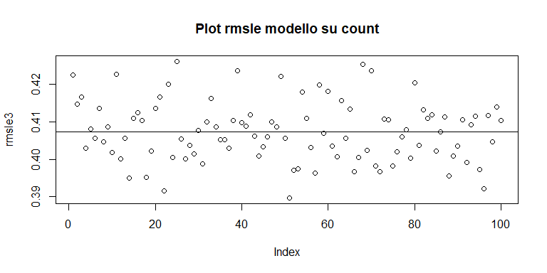
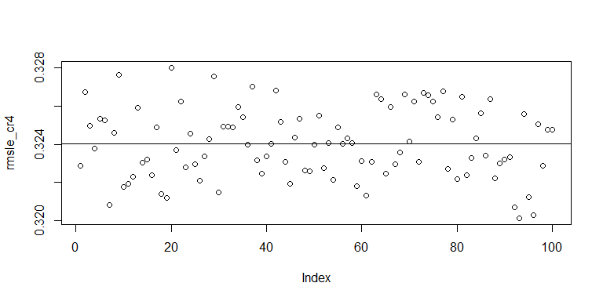
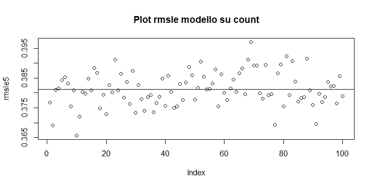
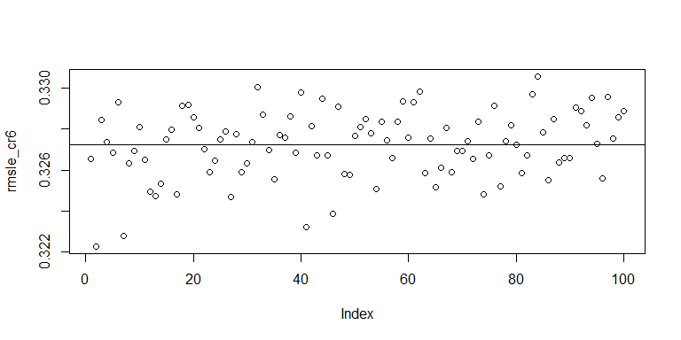
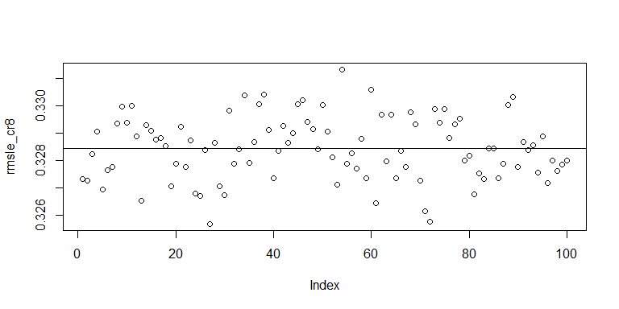
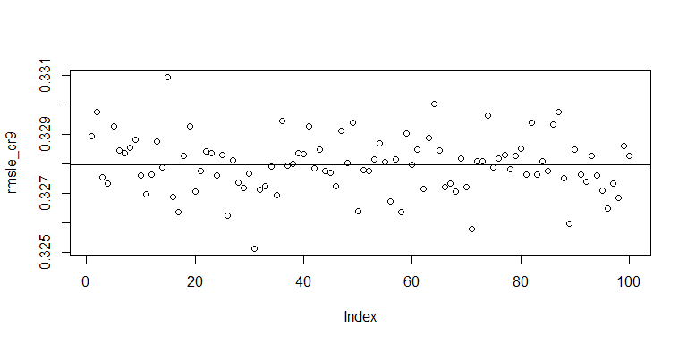
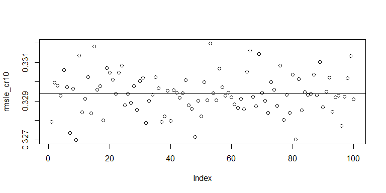

# 2. Validation

Si prepara il dataset per la validation costruendo "subtrain" e "subtest".

``` r
d1<-read.csv("./new_data/d1.csv", stringsAsFactors = F)
d2<-read.csv("./new_data/d2.csv", stringsAsFactors = F) 

# DATASET COMPLETO
d<-rbind(d1,d2);
train<-1:10886; test<-10887:17379

# TRASFORMO IN FACTOR
to.factor <- c()
for(col in colnames(d)) to.factor<-c(to.factor,class(d[,col]))
to.factor <- which(to.factor=='character')
d[,to.factor] <- lapply(d[,to.factor], as.factor); rm(to.factor, col)
d[,c('hour', 'day', 'month', 'year')] <- lapply(d[,c('hour', 'day', 'month', 'year')], as.factor)

# SUBTRAIN E SUBTEST PER LA VALIDATION
set.seed(1)
d_train <- d[train,]

p <- which(d_train[,"day"] == 15 | d_train[,"day"] == 16 | d_train[,"day"] == 17 | d_train[,"day"] == 18 | d_train[,"day"] == 19)
subtrain <- d_train[-p,]

subtest_registered <- d_train[p,24]
subtest_casual <- d_train[p,25]
subtest_count <- d_train[p,26]
subtest <- d_train[p,-c(24:26)]

subtrain$count <- log1p(subtrain$count)
subtrain$registered <- log1p(subtrain$registered)
subtrain$casual <- log1p(subtrain$casual)
```

Si effettuano diversi modelli Random Forest con diversi set di variabili. Vi è inoltre un ciclo al variare di 100 semi in quanto si è visto che i risultati sono molto sensibili ai semi scelti; si valuta una media degli RSMLE.

Modello 1
---------

Modelli con tutte le variabili, ovviamente inseriamo le misure relative a "reg" e a "cas" create da noi solo nel modello relativo.

``` r
formula.tot1 <- count ~ hour+day+wday+month+workingday+holiday+day_type+temp+humidity+humidity.reg+humidity.cas+atemp+windspeed+season+weather+weekend+year+hour.cut.reg+hour.cut.cas+temp.reg+temp.cas+mean.cas.weekend.hour+mean.reg.weekend.hour
rmsle1 <- c()
n<- 100
set.seed(1)
for(i in sample(1:1000, n, replace=F)){
  set.seed(i)
  fit.tot <- randomForest(formula.tot1, data=subtrain, ntree=50, importance=F)
  pred.tot <- expm1(predict(fit.tot, subtest))
  rmsle1 <- c(rmsle1, rmsle(subtest_count, pred.tot))
}
varImpPlot(fit.tot)
```



``` r
plot(rmsle1, main = "Plot rmsle modello su count")
abline(h = mean(rmsle1))
```



``` r
mean(rmsle1)
```

    ## [1] 0.3625918

In questo primo caso mostriamo anche uno solo dei grafici dell'importance delle variabili; se volessimo potremmo plottarli tutti al variare del seme.

Modello 2
---------

Si crea un modello sempre considerando tutte le variabili suddividendo tra gli utenti registrati e quelli dall'utilizzo saltuario. Questa suddivisione pensiamo possa portarci a miglioranmenti in quanto vi potrebbero essere predittori diversi che vanno a spiegare meglio il numero di utenti in un determinato giorno. Si inseriscono le variabili create appositamente nel preprocessing in modo opportuno nei due modelli.

``` r
# MODELLO PER REGISTERED
formula.reg2 <- registered ~ hour+day+month+wday+workingday+holiday+day_type+temp+temp.reg+humidity+humidity.reg+atemp+windspeed+season+weather+hour.cut.reg+weekend+mean.reg.weekend.hour+year
pred.reg2 <- c()
set.seed(1)

for(i in sample(1:1000, n, replace=F)){
  fit.reg <- randomForest(formula.reg2, data=subtrain, ntree=50, importance=F)
  pred.reg2 <- cbind(pred.reg2,expm1(predict(fit.reg, subtest)))
}

# MODELLO PER CASUAL
formula.cas2 <- casual ~ hour+day+wday+month+workingday+holiday+day_type+temp+temp.cas+humidity+humidity.cas+atemp+windspeed+season+weather+hour.cut.cas+weekend+mean.cas.weekend.hour+year
pred.cas2 <- c()
set.seed(1)
for(i in sample(1:1000, n, replace=F)){
fit.cas <- randomForest(formula.cas2, data=subtrain, ntree=50, importance=F)
pred.cas2 <- cbind(pred.cas2,expm1(predict(fit.cas, subtest)))
}

# COUNT
rmsle_cr2 <- c()
for(i in 1:n) {
  rmsle_cr2 <- c(rmsle_cr2, rmsle(subtest_count,pred.cas2[,i]+pred.reg2[,i]))
}

plot(rmsle_cr2)
abline(h=mean(rmsle_cr2))
```



``` r
mean(rmsle_cr2)
```

    ## [1] 0.372345

Modello 3
---------

"Day" sembra contare molto ma si pensa che questo non abbia significato quindi nei modelli 3 e 4 si prova a rimuovere tale variabile. Inoltre si osserva che le importance delle variabili riguardanti nello specifico "reg" e "cas" sono molto basse nel modello creato per prevedere direttamente "count" quindi proviamo a rimuoverle dal modello già sul totale.

``` r
formula.tot3 <- count ~ hour+wday+month+workingday+holiday+day_type+temp+humidity+atemp+windspeed+season+weather+weekend+year
rmsle3 <- c()
set.seed(1)
for(i in sample(1:1000, n, replace=F)){
  set.seed(i)
  fit.tot <- randomForest(formula.tot3, data=subtrain, ntree=50, importance=F)
  pred.tot <- expm1(predict(fit.tot, subtest))
  #varImpPlot(fit.tot)
  rmsle3 <- c(rmsle3, rmsle(subtest_count, pred.tot))
}

plot(rmsle3, main = "Plot rmsle modello su count")
abline(h = mean(rmsle3))
```



``` r
(mean(rmsle3))
```

    ## [1] 0.4073225

Modello 4
---------

``` r
# MODELLO PER REGISTERED 4

formula.reg4 <- registered ~ hour+month+wday+workingday+holiday+day_type+temp+temp.reg+humidity+humidity.reg+atemp+windspeed+season+weather+hour.cut.reg+weekend+mean.reg.weekend.hour+year
pred.reg4 <- c()
set.seed(1)

for(i in sample(1:1000, n, replace=F)){
  fit.reg <- randomForest(formula.reg4, data=subtrain, ntree=50, importance=F)
  #varImpPlot(fit.reg)
  pred.reg4 <- cbind(pred.reg4,expm1(predict(fit.reg, subtest)))
}

# MODELLO PER CASUAL 4

formula.cas4 <- casual ~ hour+wday+month+workingday+holiday+day_type+temp+temp.cas+humidity+humidity.cas+atemp+windspeed+season+weather+hour.cut.cas+weekend+mean.cas.weekend.hour+year
pred.cas4 <- c()
set.seed(1)
for(i in sample(1:1000, n, replace=F)){
  fit.cas <- randomForest(formula.cas4, data=subtrain, ntree=50, importance=F)
  #varImpPlot(fit.cas)
  pred.cas4 <- cbind(pred.cas4,expm1(predict(fit.cas, subtest)))
}

# COUNT
rmsle_cr4 <- c()
for(i in 1:n) {
  rmsle_cr4 <- c(rmsle_cr4, rmsle(subtest_count,pred.cas4[,i]+pred.reg4[,i]))
}

plot(rmsle_cr4)
abline(h = mean(rmsle_cr4))
```



``` r
mean(rmsle_cr4)
```

    ## [1] 0.324034

Si osserva un miglioramento della capacità predittiva dei modelli 3 e 4.

Se si osserva il grafico dell'**RMSLE** al variare del seme nel caso dei modelli ottenuti allenando separatamente "cas" e "reg" con tutte le variabili, la media è leggermente superiore rispetto a quella del modello costruito direttamente sul totale di "count" (si vedrà però successivamente che solitamente i modelli costruiti separatamente si rivelano migliori di quelli costruiti direttamente su "count").

Modello 5
---------

Si decide di togliere "month" in quanto tale variabile e "season" portano informazioni simili: si sceglie di tenere season perché si immagina possa aiutare a evitare overfitting: ad es. in primavera verosimilmente dipende molto più dalla temperatura e dal tempo che dal mese in sé. Si decide inoltre di togliere alcune variabili basandosi sui grafici dell'importance ottenuti precedentemente. Come nei casi precedenti si effettua prima un modello per la previsione direttamente di "count" e poi un successivo prevedendo separatamente "registered" e "casual".

``` r
formula.tot5 <- count ~ hour+wday+workingday+holiday+day_type+humidity+atemp+windspeed+season+weather+weekend+year
rmsle5 <- c()
set.seed(1)
for(i in sample(1:1000, n, replace=F)){
  set.seed(i)
  fit.tot <- randomForest(formula.tot5, data=subtrain, ntree=50, importance=F)
  pred.tot <- expm1(predict(fit.tot, subtest))
  #varImpPlot(fit.tot)
  rmsle5 <- c(rmsle5, rmsle(subtest_count, pred.tot))
}

plot(rmsle5, main = "Plot rmsle modello su count")
abline(h = mean(rmsle5))
```



``` r
(mean(rmsle5))
```

    ## [1] 0.3812753

Modello 6
---------

``` r
# MODELLO PER REGISTERED 6

formula.reg6 <- registered ~ hour+wday+workingday+day_type+temp+temp.reg+humidity+humidity.reg+atemp+windspeed+season+weather+hour.cut.reg+mean.reg.weekend.hour+year
pred.reg6 <- c()
set.seed(1)
for(i in sample(1:1000, n, replace=F)){
  fit.reg <- randomForest(formula.reg6, data=subtrain, ntree=50, importance=F)
  #varImpPlot(fit.reg)
  pred.reg6 <- cbind(pred.reg6,expm1(predict(fit.reg, subtest)))
}

# MODELLO PER CASUAL 6
formula.cas6 <- casual ~ hour+wday+workingday+day_type+temp+temp.cas+humidity+humidity.cas+atemp+windspeed+season+weather+hour.cut.cas+mean.cas.weekend.hour+year
pred.cas6 <- c()
set.seed(1)
for(i in sample(1:1000, n, replace=F)){
  fit.cas <- randomForest(formula.cas6, data=subtrain, ntree=50, importance=F)
  #varImpPlot(fit.cas)
  pred.cas6 <- cbind(pred.cas6,expm1(predict(fit.cas, subtest)))
}

# COUNT
rmsle_cr6 <- c()
for(i in 1:n) {
  rmsle_cr6 <- c(rmsle_cr6, rmsle(subtest_count,pred.cas6[,i]+pred.reg6[,i]))
}

plot(rmsle_cr6)
abline(h = mean(rmsle_cr6))
```



``` r
mean(rmsle_cr6)
```

    ## [1] 0.3272374

Modello 7
---------

Si prova un ultimo modello ancora più semplice per prevedere direttamente la varibile "count":

``` r
formula.tot7 <- count ~ hour+wday+workingday+day_type+humidity+atemp+windspeed+season+weather+year
rmsle7 <- c()
set.seed(1)
for(i in sample(1:1000, 10, replace=F)){
  set.seed(i)
  fit.tot <- randomForest(formula.tot7, data=subtrain, ntree=50, importance=F)
  pred.tot <- expm1(predict(fit.tot, subtest))
  #varImpPlot(fit.tot)
  rmsle7 <- c(rmsle7, rmsle(subtest_count, pred.tot))
}

plot(rmsle7, main = "Plot rmsle modello su count")
abline(h = mean(rmsle7))
```


``` r
(mean(rmsle7))
```

    ## [1] 0.4001489

Modello 8
---------

Da qui in avanti ci si concentrerà separatamente su "registered" e "casual" in quanto la validation su modelli basati sui due si è finore rivelata migliore: si tenta di rimuovere qualche ulteriore variabile per rendere il modello più semplice. Inoltre si può aumentare il numero di **ntree** per cercare di rendere il modello ancora più consistente. Si sceglie di considerare **ntree** =100 e coninuiamo a valutare una media tra *n* = 100 semi. Successivamente proviamo diversi set di esplicative per vedere quale sia il migliore.

``` r
# MODELLO PER REGISTERED 8

formula.reg8 <- registered ~ hour+wday+workingday+holiday+day_type+temp.reg+humidity+atemp+windspeed+season+weather+hour.cut.reg+weekend+mean.reg.weekend.hour+year
pred.reg8 <- c()
set.seed(1)

for(i in sample(1:1000, n, replace=F)){
  fit.reg <- randomForest(formula.reg8, data=subtrain, ntree=100, importance=F)
  #varImpPlot(fit.reg)
  pred.reg8 <- cbind(pred.reg8,expm1(predict(fit.reg, subtest)))
}

# MODELLO PER CASUAL 8

formula.cas8 <- casual~ hour+wday+workingday+holiday+day_type+temp.cas+humidity+atemp+windspeed+season+weather+hour.cut.cas+weekend+mean.cas.weekend.hour+year
pred.cas8 <- c()
set.seed(1)
for(i in sample(1:1000, n, replace=F)){
  fit.cas <- randomForest(formula.cas8, data=subtrain, ntree=100, importance=F)
  #varImpPlot(fit.cas)
  pred.cas8 <- cbind(pred.cas8,expm1(predict(fit.cas, subtest)))
}

# COUNT

rmsle_cr8 <- c()
for(i in 1:n) {
  rmsle_cr8 <- c(rmsle_cr8, rmsle(subtest_count,pred.cas8[,i]+pred.reg8[,i]))
}

plot(rmsle_cr8)
abline(h = mean(rmsle_cr8))
```



``` r
mean(rmsle_cr8)
```

    ## [1] 0.3284247

Modello 9
---------

``` r
# MODELLO PER REGISTERED

formula.reg9 <- registered ~ hour+wday+workingday+day_type+temp.reg+humidity+atemp+windspeed+season+weather+hour.cut.reg+mean.reg.weekend.hour+year
pred.reg9 <- c()
set.seed(1)

for(i in sample(1:1000, n, replace=F)){
  fit.reg <- randomForest(formula.reg9, data=subtrain, ntree=100, importance=F)
  #varImpPlot(fit.reg)
  pred.reg9 <- cbind(pred.reg9,expm1(predict(fit.reg, subtest)))
}

# MODELLO PER CASUAL

formula.cas9 <- casual~ hour+wday+workingday+day_type+temp.cas+humidity+atemp+windspeed+season+weather+hour.cut.cas+mean.cas.weekend.hour+year
pred.cas9 <- c()
set.seed(1)
for(i in sample(1:1000, n, replace=F)){
  fit.cas <- randomForest(formula.cas9, data=subtrain, ntree=100, importance=F)
  #varImpPlot(fit.cas)
  pred.cas9 <- cbind(pred.cas9,expm1(predict(fit.cas, subtest)))
}

# COUNT
rmsle_cr9 <- c()
for(i in 1:n) {
  rmsle_cr9 <- c(rmsle_cr9, rmsle(subtest_count,pred.cas9[,i]+pred.reg9[,i]))
}

plot(rmsle_cr9)
abline(h = mean(rmsle_cr9))
```



``` r
mean(rmsle_cr9)
```

    ## [1] 0.327947

Modello 10
----------

``` r
# MODELLO PER REGISTERED

formula.reg10 <- registered ~ hour+wday+workingday+day_type+temp.reg+humidity+atemp+windspeed+season+weather+mean.reg.weekend.hour+year
pred.reg10 <- c()
set.seed(1)

for(i in sample(1:1000, n, replace=F)){
  fit.reg <- randomForest(formula.reg10, data=subtrain, ntree=100, importance=F)
  #varImpPlot(fit.reg)
  pred.reg10 <- cbind(pred.reg10,expm1(predict(fit.reg, subtest)))
}

# MODELLO PER CASUAL

formula.cas10 <- casual~ hour+wday+workingday+day_type+temp.cas+humidity+atemp+windspeed+season+weather+mean.cas.weekend.hour+year
pred.cas10 <- c()
set.seed(1)
for(i in sample(1:1000, n, replace=F)){
  fit.cas <- randomForest(formula.cas10, data=subtrain, ntree=100, importance=F)
  #varImpPlot(fit.cas)
  pred.cas10 <- cbind(pred.cas10,expm1(predict(fit.cas, subtest)))
}

# COUNT
rmsle_cr10 <- c()
for(i in 1:n) {
  rmsle_cr10 <- c(rmsle_cr10, rmsle(subtest_count,pred.cas10[,i]+pred.reg10[,i]))
}

plot(rmsle_cr10)
abline(h = mean(rmsle_cr10))
```



``` r
mean(rmsle_cr10)
```

    ## [1] 0.329394

Tabella riassuntiva dei risultati ottenuti coi 10 modelli
---------------------------------------------------------

| Set di variabili | Stima MRSLE | nseed | ntree | Divisione in cas e reg |
|------------------|-------------|-------|-------|------------------------|
| Formula 1        | 0.3628113   | 100   | 50    |                        |
| Formula 2        | 0.3718077   | 100   | 50    | \*                     |
| Formula 3        | 0.4073225   | 100   | 50    |                        |
| Formula 4        | 0.3242871   | 100   | 50    | \*                     |
| Formula 5        | 0.3812753   | 100   | 50    |                        |
| Formula 6        | 0.3272374   | 100   | 50    | \*                     |
| Formula 7        | 0.4001258   | 100   | 50    |                        |
| Formula 8        | 0.3284247   | 100   | 100   | \*                     |
| Formula 9        | 0.327947    | 100   | 100   | \*                     |
| Formula 10       | 0.3292557   | 100   | 100   | \*                     |
