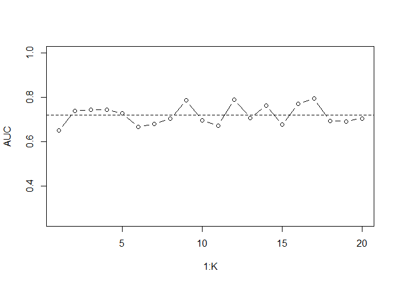
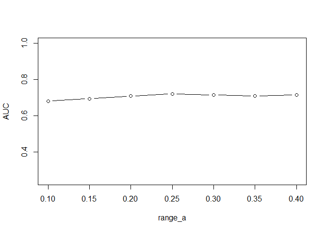

# Random Forests Bilanciati

## Tutte le variabili

```r
# READ CSV
d <- read.csv('./new_datasets/data.csv')
# VARIABILI DA TENERE:
attrs <- colnames(d)[which(colnames(d)!='Class')]
```

Un modello solo:

```r
# CREO TRAINING SET E TEST SET PER VALUTARE MODELLI
set.seed(1)
N <- 500
p <- sample(1:nrow(d), size=N, replace = F)
y_train <- d[-p, 'Class']
X_train <- d[-p, which(colnames(d)!='Class')]
y_test <- d[p,'Class']
X_test <- d[p, which(colnames(d)!='Class')]

# FIT
w = 0.50
train <- data.frame(X_train[,attrs], CLASS=y_train)
set.seed(2)
rf.classwt = randomForest(CLASS~.,data=train,ntree=1000,mtry=4,classwt=c(w,1-w),nodesize=1)

# PREDICT
y_pred=predict(rf.classwt,newdata=X_test[,attrs], type='prob')[,"stem"]
Evaluate(y_test,ifelse(y_pred>0.5,"stem","other"))
```

```
##        pred
## real    other stem
##   other   395   11
##   stem     68   26
## [1] "Accuracy: 0.842"
## [1] "AUC: 0.624751074310869"
```

Chiaramente il problema è w (il peso delle modalità della variabile classe). Ho fatto quindi un for con diversi valori di w, ma i risultati sono comunque poco soddisfacenti in quanto ci sono troppe variabili nel dataset. Vediamo di farne una selezione.

## Sottoinsieme di variabili 1) (BeeViva submissions)

Pongo w=0.35 (ottenuto con una CV, ma i risultati sono scarsi)


```r
attrs <- c("male", "essay_link", "tech", "computer", "science", "fixing", 
           "matrix", "electronic", "nerdy", "artist", "SV", "body_type_A", "diet_A", "single",
           "student", "teaching", "loyal", "atheist", "smoke", "sign_imp", 
           "education_A", "income100000", "phdYN") 

# FIT
w = 0.35
train <- data.frame(X_train[,attrs], CLASS=y_train)
set.seed(2)
rf.classwt = randomForest(CLASS~.,data=train,ntree=1000,mtry=4,classwt=c(w,1-w),nodesize=1)

# PREDICT
y_pred=predict(rf.classwt,newdata=X_test[,attrs], type='prob')[,"stem"]
Evaluate(y_test,ifelse(y_pred>0.5,"stem","other"))
```

```
##        pred
## real    other stem
##   other   304  102
##   stem     38   56
## [1] "Accuracy: 0.72"
## [1] "AUC: 0.672256576878734"
```

Random forest bilanciato manuale (alpha = 0.5, ovvero 11 variabili):


```r
fit1 <- rfb.fit(X_train[,attrs],fixed_attrs=0,y_train,theta=1,alpha=0.5,B=1000,minsplit=10, minbucket=10)
y_pred1 <- rfb.predict(fit1, newdata = X_test[,attrs], method='median')
Evaluate(y_test,ifelse(y_pred1>0.5,"stem","other"))
```

```
##        pred
## real    other stem
##   other   287  119
##   stem     22   72
## [1] "Accuracy: 0.718"
## [1] "AUC: 0.736426999266324"
```

Random forest bilanciato manuale (alpha = 0.45, ovvero 10 variabili):

```r
fit1 <- rfb.fit(X_train[,attrs],fixed_attrs=0,y_train,theta=1,alpha=0.45,B=1000,minsplit=10, minbucket=10)
y_pred1 <- rfb.predict(fit1, newdata = X_test[,attrs], method='median')
Evaluate(y_test,ifelse(y_pred1>0.5,"stem","other"))
```

```
##        pred
## real    other stem
##   other   286  120
##   stem     22   72
## [1] "Accuracy: 0.716"
## [1] "AUC: 0.735195472172728"
```

Random forest bilanciato manuale (alpha = 0.4, ovvero 9 variabili):

```r
fit1 <- rfb.fit(X_train[,attrs],fixed_attrs=0,y_train,theta=1,alpha=0.4,B=1000,minsplit=10, minbucket=10)
y_pred1 <- rfb.predict(fit1, newdata = X_test[,attrs], method='median')
Evaluate(y_test,ifelse(y_pred1>0.5,"stem","other"))
```

```
##        pred
## real    other stem
##   other   291  115
##   stem     25   69
## [1] "Accuracy: 0.72"
## [1] "AUC: 0.725395660832198"
```

Random forest bilanciato manuale (alpha = 0.35, ovvero 8 variabili):

```r
fit1 <- rfb.fit(X_train[,attrs],fixed_attrs=0,y_train,theta=1,alpha=0.35,B=1000,minsplit=10, minbucket=10)
y_pred1 <- rfb.predict(fit1, newdata = X_test[,attrs], method='median')
Evaluate(y_test,ifelse(y_pred1>0.5,"stem","other"))
```

```
##        pred
## real    other stem
##   other   302  104
##   stem     31   63
## [1] "Accuracy: 0.73"
## [1] "AUC: 0.707027565244733"
```

Random forest bilanciato manuale (alpha = 0.3, ovvero 6 variabili):

```r
fit1 <- rfb.fit(X_train[,attrs],fixed_attrs=0,y_train,theta=1,alpha=0.3,B=1000,minsplit=10, minbucket=10)
y_pred1 <- rfb.predict(fit1, newdata = X_test[,attrs], method='median')
Evaluate(y_test,ifelse(y_pred1>0.5,"stem","other"))
```

```
##        pred
## real    other stem
##   other   322   84
##   stem     35   59
## [1] "Accuracy: 0.762"
## [1] "AUC: 0.710381511371974"
```

Random forest bilanciato manuale (alpha = 0.25, ovvero 5 variabili):

```r
fit1 <- rfb.fit(X_train[,attrs],fixed_attrs=0,y_train,theta=1,alpha=0.25,B=1000,minsplit=10, minbucket=10)
y_pred1 <- rfb.predict(fit1, newdata = X_test[,attrs], method='median')
Evaluate(y_test,ifelse(y_pred1>0.5,"stem","other"))
```

```
##        pred
## real    other stem
##   other   328   78
##   stem     36   58
## [1] "Accuracy: 0.772"
## [1] "AUC: 0.71245152499738"
```

Random forest bilanciato manuale (alpha = 0.2, ovvero 4 variabili):

```r
fit1 <- rfb.fit(X_train[,attrs],fixed_attrs=0,y_train,theta=1,alpha=0.2,B=1000,minsplit=10, minbucket=10)
y_pred1 <- rfb.predict(fit1, newdata = X_test[,attrs], method='median')
Evaluate(y_test,ifelse(y_pred1>0.5,"stem","other"))
```

```
##        pred
## real    other stem
##   other   343   63
##   stem     39   55
## [1] "Accuracy: 0.796"
## [1] "AUC: 0.71496698459281"
```

Random forest bilanciato manuale (alpha = 0.15, ovvero 3 variabili):

```r
fit1 <- rfb.fit(X_train[,attrs],fixed_attrs=0,y_train,theta=1,alpha=0.15,B=1000,minsplit=10, minbucket=10)
y_pred1 <- rfb.predict(fit1, newdata = X_test[,attrs], method='median')
Evaluate(y_test,ifelse(y_pred1>0.5,"stem","other"))
```

```
##        pred
## real    other stem
##   other   358   48
##   stem     43   51
## [1] "Accuracy: 0.818"
## [1] "AUC: 0.71216329525207"
```

Random forest bilanciato manuale (alpha = 0.1, ovvero 2 variabili):

```r
fit1 <- rfb.fit(X_train[,attrs],fixed_attrs=0,y_train,theta=1,alpha=0.1,B=1000,minsplit=10, minbucket=10)
y_pred1 <- rfb.predict(fit1, newdata = X_test[,attrs], method='median')
Evaluate(y_test,ifelse(y_pred1>0.5,"stem","other"))
```

```
##        pred
## real    other stem
##   other   355   51
##   stem     44   50
## [1] "Accuracy: 0.81"
## [1] "AUC: 0.703149565035112"
```

Alpha = 0.25 -> BeeViva 76,24\%

Alpha = 0.2 -> BeeViva 76,42\%

Alpha = 0.15 -> BeeViva 76,66\%

Abbassando alpha, si spostano verso "other" le previsioni. Presumo che per ottenere un punteggio alto si debba comunque mantenere una previsione equilibrata e distorta verso "other".

## Sottoinsieme di variabili 2)


```r
attrs <- c("male", "UnionDummy", "educ_dummy1", "educ_dummy2", "age_dummy", "sign_imp", "education_A",
           "income100000", "SV", "phdYN", "tech", "computer", "science")
```


```r
# FIT
w = 0.35
train <- data.frame(X_train[,attrs], CLASS=y_train)
set.seed(2)
rf.classwt = randomForest(CLASS~.,data=train,ntree=1000,mtry=4,classwt=c(w,1-w),nodesize=1)

# PREDICT
y_pred=predict(rf.classwt,newdata=X_test[,attrs], type='prob')[,"stem"]
Evaluate(y_test,ifelse(y_pred>0.5,"stem","other"))
```

```
##        pred
## real    other stem
##   other   260  146
##   stem     18   76
## [1] "Accuracy: 0.672"
## [1] "AUC: 0.724452363483912"
```

Random forest bilanciato manuale:


```r
fit1 <- rfb.fit(X_train[,attrs],fixed_attrs=0,y_train,theta=1,alpha=0.5,B=1000,minsplit=10, minbucket=10)
y_pred1 <- rfb.predict(fit1, newdata = X_test[,attrs], method='median')
Evaluate(y_test,ifelse(y_pred1>0.5,"stem","other"))
```

```
##        pred
## real    other stem
##   other   258  148
##   stem     25   69
## [1] "Accuracy: 0.654"
## [1] "AUC: 0.684755266743528"
```

Se seleziono un sotto-sottoinsieme di variabili che devono essere sempre estratte immagino che aumenti il numero di stem previsti (in quanto seleziono solo variabili significative).


```r
fixed_attrs = c("UnionDummy", "educ_dummy1", "male", "phdYN")
fit1 <- rfb.fit(X_train[,attrs],fixed_attrs=fixed_attrs,y_train,theta=1,alpha=0.5,B=1000,minsplit=10, minbucket=10)
y_pred1 <- rfb.predict(fit1, newdata = X_test[,attrs], method='median')
Evaluate(y_test,ifelse(y_pred1>0.5,"stem","other"))
```

```
##        pred
## real    other stem
##   other   241  165
##   stem     14   80
## [1] "Accuracy: 0.642"
## [1] "AUC: 0.722329944450267"
```

## Sottoinsieme di variabili 3)


```r
attrs <- c("male", "UnionDummy", "educ_dummy1", "educ_dummy2", "age_dummy", "education_A","income100000", "SV", "tech")
```


```r
# FIT
w = 0.35
train <- data.frame(X_train[,attrs], CLASS=y_train)
set.seed(2)
rf.classwt = randomForest(CLASS~.,data=train,ntree=1000,mtry=4,classwt=c(w,1-w),nodesize=1)

# PREDICT
y_pred=predict(rf.classwt,newdata=X_test[,attrs], type='prob')[,"stem"]
Evaluate(y_test,ifelse(y_pred>0.5,"stem","other"))
```

```
##        pred
## real    other stem
##   other   251  155
##   stem     16   78
## [1] "Accuracy: 0.658"
## [1] "AUC: 0.724006917513887"
```

Random forest bilanciato manuale:


```r
fit1 <- rfb.fit(X_train[,attrs],fixed_attrs=0,y_train,theta=1,alpha=0.5,B=1000,minsplit=10, minbucket=10)
y_pred1 <- rfb.predict(fit1, newdata = X_test[,attrs], method='median')
Evaluate(y_test,ifelse(y_pred1>0.5,"stem","other"))
```

```
##        pred
## real    other stem
##   other   253  153
##   stem     20   74
## [1] "Accuracy: 0.654"
## [1] "AUC: 0.705193375956399"
```


## Conclusione

Sottoinsieme 1) Manuale è il più equilibrato: predice in modo abbastanza proporzionato;

Sottoinsieme 2) Automatico è simile a quello sopra ma è piuttosto distorto verso stem. Quello con variabili fisse ancor di più;

Sottoinsieme 3) Automatico è simile al 2)+fixed, meno distorto

Tutti e tre vengono cross-validati per valutare effettivamente le AUC.

# Random Forests Bilanciati

```r
# READ CSV
d <- read.csv('./new_datasets/data.csv')
```

# Cross validation ai modelli migliori

## Stima dell'AUC iniziale


```r
attrs <- c("male", "essay_link", "tech", "computer", "science", "fixing", 
           "matrix", "electronic", "nerdy", "artist", "SV", "body_type_A", "diet_A", "single",
           "student", "teaching", "loyal", "atheist", "smoke", "sign_imp", 
           "education_A", "income100000", "phdYN")
```


```r
# K-FOLDS CROSS VALIDATION (K=20)
K = 20
AUC=c()
N <- as.integer(nrow(d)/K)
set_rows <- 1:nrow(d)

for(k in 1:K){
  set.seed(k)
  p <- sample(set_rows, size=N, replace = F)
  set_rows <- setdiff(set_rows,p)
  # suddivisione training/test set
  y_train <- d[-p, 'Class']
  X_train <- d[-p, which(colnames(d)!='Class')]
  y_test <- d[p,'Class']
  X_test <- d[p, which(colnames(d)!='Class')]
  # fit
  fit.k <- rfb.fit(X_train[,attrs],fixed_attrs=0,y_train,theta=1,alpha=0.25,B=500,minsplit=10, minbucket=10)
  # predict
  y_pred.k <- rfb.predict(fit.k, newdata = X_test[,attrs], method='median')
  # evaluate
  print(paste("Step ",k,"/",K,sep=""))
  Evaluate(y_test,ifelse(y_pred.k >= 0.5, "stem", "other"))
  
  AUC[k] = Evaluate(y_test,ifelse(y_pred.k >= 0.5, "stem", "other"), echo = FALSE)$auc
}
```

```
[1] "Step 1/20"
```

```
Loaded ROSE 0.0-3
```

```
       pred
real    other stem
  other   145   19
  stem     21   15
[1] "Accuracy: 0.8"
[1] "AUC: 0.650406504065041"
[1] 
[1] "Step 2/20"
       pred
real    other stem
  other   127   43
  stem      8   22
[1] "Accuracy: 0.745"
[1] "AUC: 0.740196078431373"
[1] 
[1] "Step 3/20"
       pred
real    other stem
  other   128   37
  stem     10   25
[1] "Accuracy: 0.765"
[1] "AUC: 0.745021645021645"
[1] 
[1] "Step 4/20"
       pred
real    other stem
  other   128   37
  stem     10   25
[1] "Accuracy: 0.765"
[1] "AUC: 0.745021645021645"
[1] 
[1] "Step 5/20"
       pred
real    other stem
  other   108   54
  stem      8   30
[1] "Accuracy: 0.69"
[1] "AUC: 0.728070175438597"
[1] 
[1] "Step 6/20"
       pred
real    other stem
  other   122   49
  stem     11   18
[1] "Accuracy: 0.7"
[1] "AUC: 0.667069973785037"
[1] 
[1] "Step 7/20"
       pred
real    other stem
  other   131   36
  stem     14   19
[1] "Accuracy: 0.75"
[1] "AUC: 0.680094356741063"
[1] 
[1] "Step 8/20"
       pred
real    other stem
  other   132   36
  stem     12   20
[1] "Accuracy: 0.76"
[1] "AUC: 0.705357142857143"
[1] 
[1] "Step 9/20"
       pred
real    other stem
  other   112   45
  stem      6   37
[1] "Accuracy: 0.745"
[1] "AUC: 0.786920456228707"
[1] 
[1] "Step 10/20"
       pred
real    other stem
  other   123   49
  stem      9   19
[1] "Accuracy: 0.71"
[1] "AUC: 0.696843853820598"
[1] 
[1] "Step 11/20"
       pred
real    other stem
  other   119   30
  stem     23   28
[1] "Accuracy: 0.735"
[1] "AUC: 0.673838662981971"
[1] 
[1] "Step 12/20"
       pred
real    other stem
  other   131   41
  stem      5   23
[1] "Accuracy: 0.77"
[1] "AUC: 0.791528239202658"
[1] 
[1] "Step 13/20"
       pred
real    other stem
  other   106   43
  stem     15   36
[1] "Accuracy: 0.71"
[1] "AUC: 0.708645874457165"
[1] 
[1] "Step 14/20"
       pred
real    other stem
  other   118   43
  stem      8   31
[1] "Accuracy: 0.745"
[1] "AUC: 0.76389552476509"
[1] 
[1] "Step 15/20"
       pred
real    other stem
  other   133   35
  stem     14   18
[1] "Accuracy: 0.755"
[1] "AUC: 0.677083333333333"
[1] 
[1] "Step 16/20"
       pred
real    other stem
  other   121   46
  stem      6   27
[1] "Accuracy: 0.74"
[1] "AUC: 0.771366358192706"
[1] 
[1] "Step 17/20"
       pred
real    other stem
  other   124   37
  stem      7   32
[1] "Accuracy: 0.78"
[1] "AUC: 0.795349577958274"
[1] 
[1] "Step 18/20"
       pred
real    other stem
  other   125   38
  stem     14   23
[1] "Accuracy: 0.74"
[1] "AUC: 0.694246393632897"
[1] 
[1] "Step 19/20"
       pred
real    other stem
  other   127   37
  stem     14   22
[1] "Accuracy: 0.745"
[1] "AUC: 0.692750677506775"
[1] 
[1] "Step 20/20"
       pred
real    other stem
  other   121   35
  stem     16   28
[1] "Accuracy: 0.745"
[1] "AUC: 0.706002331002331"
[1] 
```

```r
plot(1:K, AUC, type='b', ylim=c(0.25,1))
abline(h=mean(AUC), lty=2)
```

<!-- -->

```r
mean(AUC)
```

```
[1] 0.7209854
```


## Scelta di alpha con 20-Folds CV


```r
# K-FOLDS CROSS VALIDATION (K=20)
K = 20
range_a <- c(0.1,0.15,0.20,0.25,0.3,0.35,0.4)

AUC=c()
for (a in range_a){
  auc.K=c()
  N <- as.integer(nrow(d)/K)
  set_rows <- 1:nrow(d)
  for(k in 1:K){
    set.seed(k)
    p <- sample(set_rows, size=N, replace = F)
    set_rows <- setdiff(set_rows,p)
    # suddivisione training/test set
    y_train <- d[-p, 'Class']
    X_train <- d[-p, which(colnames(d)!='Class')]
    y_test <- d[p,'Class']
    X_test <- d[p, which(colnames(d)!='Class')]
    # fit
    fit.k <- rfb.fit(X_train[,attrs],fixed_attrs=0,y_train,theta=1,alpha=a,B=500,minsplit=10, minbucket=10)
    # predict
    y_pred.k <- rfb.predict(fit.k, newdata = X_test[,attrs], method='median')
    
    auc.K[k] = Evaluate(y_test,ifelse(y_pred.k >= 0.5, "stem", "other"), echo = FALSE)$auc
  }
  AUC=c(AUC,mean(auc.K))
}

plot(range_a,AUC, type='b', ylim=c(0.25,1))
```

<!-- -->

```r
range_a[which.max(AUC)]
```

```
[1] 0.25
```
